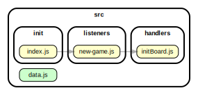

<!-- BEGIN TITLE -->

# DOCS

<!-- END TITLE -->

<!-- BEGIN TREE -->

<!-- END TREE -->

<!-- BEGIN TOC -->

- handlers
  - [hide-number.js](#srchandlershide-numberjs)
  - [initBoard.js](#srchandlersinitBoardjs)
  - [open-number.js](#srchandlersopen-numberjs)
  - [show-number.js](#srchandlersshow-numberjs)
- init
  - [index.js](#srcinitindexjs)
- listeners
  - [new-game.js](#srclistenersnew-gamejs)
  - [open-number.js](#srclistenersopen-numberjs)
  - [sneak-peek.js](#srclistenerssneak-peekjs)
- logic
- procedures
- [data.js](#srcdatajs)

<!-- END TOC -->

<!-- BEGIN DOCS -->

---

# /handlers

<a href="../src/handlers/hide-number.js" id="srchandlershide-numberjs">src/handlers/hide-number.js</a>

<a href="../src/handlers/initBoard.js" id="srchandlersinitBoardjs">src/handlers/initBoard.js</a>

<a href="../src/handlers/open-number.js" id="srchandlersopen-numberjs">src/handlers/open-number.js</a>

<a href="../src/handlers/show-number.js" id="srchandlersshow-numberjs">src/handlers/show-number.js</a>

---

[TOP](#DOCS)

---

# /init

<a href="../src/init/index.js" id="srcinitindexjs">src/init/index.js</a>

---

[TOP](#DOCS)

---

# /listeners

<a href="../src/listeners/new-game.js" id="srclistenersnew-gamejs">src/listeners/new-game.js</a>

<a href="../src/listeners/open-number.js" id="srclistenersopen-numberjs">src/listeners/open-number.js</a>

<a href="../src/listeners/sneak-peek.js" id="srclistenerssneak-peekjs">src/listeners/sneak-peek.js</a>

---

[TOP](#DOCS)

---

# /logic

---

[TOP](#DOCS)

---

# /procedures

---

[TOP](#DOCS)

<a href="../src/data.js" id="srcdatajs">src/data.js</a>

<!-- END DOCS -->
